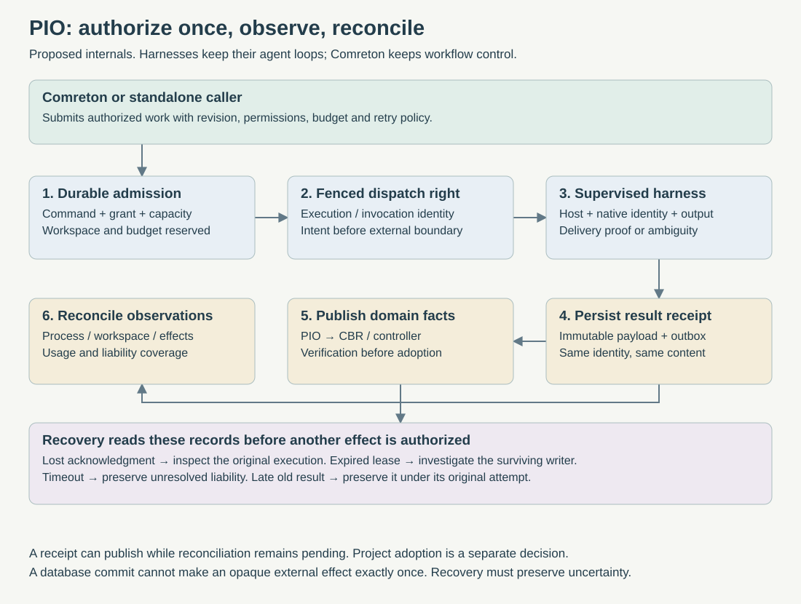

> Public edition `public-development-v1-20260913`. Adapted from the reviewed architecture baseline; names in the source may still say Comreton. See [publication and authority](https://github.com/Combraton/combraton/blob/main/docs/architecture/PUBLICATION.md). Development sequencing is governed by [DEVELOPMENT](https://github.com/Combraton/combraton/blob/main/docs/DEVELOPMENT.md); self-development is deferred until all four usable v0.1 releases.

# PIO internals: supervised execution with durable receipts

> Accepted execution mechanics in [BASELINE](https://github.com/Combraton/combraton/blob/main/docs/architecture/BASELINE.md). Read with [PIO spec](SPEC.md) and [protocol](https://github.com/Combraton/protocol/blob/main/docs/spec/SPEC.md); the September 9 source assessment is historical rationale.

**PIO should become more precise about who may execute, what may have happened, what it cost, and what can safely happen next.** Puppetmaster contributes useful execution mechanisms. Its workflow engine, routing policy and memory promotion rules do not become PIO's architecture.

## 1. Keep the boundary fixed

Comreton decides which workflow node is ready, which revision governs it, what budget to authorize and whether the result is accepted. PIO admits the resulting execution request against real capacity, permissions, workspace policy and adapter capabilities. Its local scheduler chooses among authorized requests; it does not decide the project's methodology.

Existing harnesses retain their own agent loops. PIO supervises those harnesses through portable/native adapters and durable hosts. A result receipt is execution evidence, not project acceptance. Standalone PIO accepts equivalent work and policy from a CLI, another application or a local controller.

These are logical modules in the existing service/host design, not new microservices: admission ledger, claim/fence manager, invocation accounting, adapter host, completion publisher and reconciler.

## 2. Separate identities before writing the scheduler

| Identity | Meaning | Must not be reused as |
|---|---|---|
| Work / node-attempt binding | Controller's reason for this execution | Native session or billing identity |
| Execution ID | One admitted execution; a new workflow retry gets a new execution | Resettable retry number |
| Invocation ID | One PIO-visible external invocation inside an execution | “Whichever result was selected” |
| Delivery/effect ID | One prompt submission or other external effect episode | A new ID every network retry |
| Native session/turn ID | Harness-provided identity, where supported | Proof of delivery by itself |
| Host slot and process generation | Owned process lifetime | Bare PID |
| Controller epoch / worker claim token / workspace lease | Separate authority and ownership fences | One universal lease |
| Completion ID | Immutable submission of a particular result payload | Permission to overwrite a later attempt |

Preserve the current protocol meaning: **a new workflow attempt gets a fresh execution identity**. Internal invocation IDs describe calls PIO can actually observe. An opaque harness may make many internal provider calls; PIO must report that coverage limit rather than inventing a complete invocation ledger.

Protocol/CLI retransmission under the same command identity reads or completes the prior operation. It never means “run again.” An authorized new attempt links to its predecessor and retains its costs and evidence.

## 3. Admission and fenced claims

In one PIO writer transaction, check the command/digest, bound grant and authority epoch, adapter requirements, workspace reservation, queue policy and applicable budget counters. Commit admission, resource reservations, launch intent and outgoing work. If canonical persistence fails, no new external invocation is authorized.

Use explicit capability predicates: required-all features, selected alternatives, and enforcement level. Missing capability information is unknown, not “supports everything.” Worktree isolation does not prove a security sandbox.

Each claim gets a fresh token bound to execution, worker/host and generation. Heartbeats, publication and mutations compare that token and the relevant current epoch on the actual writer transaction. Reusing a worker name is not enough. An expired heartbeat permits recovery investigation; it does not prove the worker stopped or allow a successor to write into the same live workspace.

Fencing can stop stale mediated operations. It cannot retroactively stop an external provider request or an already-running process. Before admitting a conflicting writer, reconcile and isolate/stop the prior writer under verified host ownership. If that is impossible, retain a conflict and expose the limitation.

## 4. Dispatch is a durable boundary, not a subprocess call

The [existing launch barrier](SPEC.md) remains. Add explicit invocation bookkeeping around it:

1. Allocate an invocation ID and persist launch intent, identity bindings and any allowance reservation before the external boundary.
2. Acquire a fenced dispatch right. A repeated acquisition with identical facts is a recovery read, not permission to invoke again.
3. Persist dispatch uncertainty before releasing the host's launch/submission barrier. Record stable host/native identifiers as they become observable.
4. Recheck cancellation, authority and ownership at the last mediated boundary. This narrows the race; it cannot make a database transaction atomic with an external service.
5. Submit once under the supported effect identity. Capture acknowledgments and output independently; do not turn PTY bytes written into harness acceptance.
6. Record observations, then reconcile delivery, process outcome, workspace and outstanding effects.

Keep this journal even for unbudgeted requests. Budget policy being absent is not permission to lose dispatch history. PIO-mediated retries/fallback invocations require their own admission and cannot silently switch harness, broaden permissions, replay opaque effects or exceed the controller's retry policy.

## 5. Budget admission and usage truth

Comreton grants budget; PIO accounts for its local consumption and reservations. Multiple PIO installations need disjoint allocations or an explicit shared budget authority. Independent local counters cannot enforce one global ceiling.

For each configured metric, admission considers settled consumption, active reservations and unresolved liability **once per invocation**. Record the basis: observed, estimated, unknown, or externally enforced bound. Never add overlapping final/cumulative usage snapshots. Preserve conflicting observations for reconciliation.

An example: a local grant allows ten PIO-visible invocations. Three were completed, two are dispatching and one has an unknown outcome. Four invocation slots remain. A timeout does not refund the unknown invocation. Its unknown dollar cost remains unknown even though its invocation count is known.

For a dollar cap, estimated allowances support planning but cannot guarantee maximum billing. If a caller requires a hard ceiling and the adapter/provider cannot enforce a bound, refuse that guarantee. Pending unknown cost blocks further cost-constrained admission unless a valid enforced upper bound safely covers the liability. Unrelated grants can continue. Report an actual overrun faithfully rather than rejecting inconvenient usage evidence.

Release an unused reservation only with durable evidence that the invocation was never dispatched and can no longer be dispatched under that identity. A crash, timeout or lease expiry is not such evidence. Keep API charges, subscription marginal charges and API-equivalent estimates separate; neither missing telemetry nor subscription status automatically means zero.

Use distinct wall deadline, inactivity timeout, cancellation grace and summed invocation duration. A deadline closes a permitted wait or triggers control action; it does not prove remote work ended.

## 6. Completion: preserve the result before reporting it

A producer submits an immutable completion payload bound to execution, invocation/attempt, host generation, claim token, output descriptors and capture coverage. Seal required large payloads before committing a descriptor that claims availability.

Commit the completion receipt, domain facts and outgoing events in one PIO transaction. Publication to CBR or Comreton happens through the existing outbox. Track local receipt durability, remote publication progress, process/effect reconciliation, and external verification as separate facts. Any verification or adoption status exposed by PIO is an attributed external reference; it does not give PIO evaluator or project-acceptance authority.

Same completion identity and same digest returns the existing receipt. Same identity with different content conflicts. A late result from an old claim can be retained as historical evidence with its original identity, but cannot finalize the current successor. If an old receipt was already committed before a claim changed, recovery republishes that fact; it does not rewrite history.

A result can be preserved while billing reconciliation is pending. An execution can end with partial output and explicitly unavailable artifacts. Required missing evidence blocks the relevant claim/contract; it should not make the system pretend no output was ever produced.

Do not infer completion from a terminal process, accepted artifact from a worker rating, or current success from “latest result for this task.” Comreton adopts only after the relevant verification and authority conditions hold.

## 7. Recovery decisions, with examples

| Observed situation | Correct action | Forbidden shortcut |
|---|---|---|
| Owner receipt exists; client lost acknowledgment | Return/replay same receipt | Start another execution |
| Submission intent exists; delivery cannot be established | Probe host/native session; preserve ambiguity | Treat timeout as non-delivery |
| Worker lease expired; host may still be running | Fence mediated writes and reconcile ownership | Immediately grant same workspace to a successor |
| Completion recorded; remote publication interrupted | Resume publication with original identity | Regenerate the completion from mutable files |
| Cancellation requested; remote work unknown | Preserve request and unresolved effect liability | Display confirmed cancellation |
| Database restored from yesterday | Reconcile live hosts/effects before admission | Assume the restored journal contains every effect |

Maintain installation/store identity and validate it when attaching. A store incarnation detects replacement with another store; it does **not** detect rollback to an old backup of the same store. Restore therefore needs an explicit recovery barrier, live-host/effect comparison, and reconciliation of controller generations before new writes. A UUID is not an access token or a complete split-brain solution.

Read APIs use bounded metadata projections and opaque cursors with declared coverage. Listing sessions should not hydrate megabytes of transcripts. Read-only inspection never performs migrations or hidden repairs. Unavailable metadata is not an empty queue or zero spend.

## 8. What we take from Puppetmaster—and change

The inspected source is pinned to [8ee0c59](https://github.com/professorpalmer/Puppetmaster/tree/8ee0c59fd95af193f98426fd36d74bc9131d8392). This is source inspection, not proof from running its fault suite.

| Source | Useful mechanism | PIO adaptation |
|---|---|---|
| [SQLite claim code](https://github.com/professorpalmer/Puppetmaster/blob/8ee0c59fd95af193f98426fd36d74bc9131d8392/puppetmaster/sqlite_store.py#L1134) | Serialized claim with guarded update and pending-completion awareness | Require fresh claim tokens for new mutations; lease expiry alone never proves safe rerun |
| [Invocation boundary](https://github.com/professorpalmer/Puppetmaster/blob/8ee0c59fd95af193f98426fd36d74bc9131d8392/puppetmaster/invocation.py#L75) | Invocation identity independent of retry counters; admission before dispatch | Mandatory execution journaling even without a budget policy |
| [Attempt records](https://github.com/professorpalmer/Puppetmaster/blob/8ee0c59fd95af193f98426fd36d74bc9131d8392/puppetmaster/attempts.py) | Immutable usage observations, explicit unknowns, overlapping snapshots | Retain all observed attempts, not only selected outputs |
| [Budget contract](https://github.com/professorpalmer/Puppetmaster/blob/8ee0c59fd95af193f98426fd36d74bc9131d8392/docs/BUDGET_RESERVATIONS.md) | Reservations and unresolved liability | Bind to controller grants; expose enforcement limits |
| [Store contracts](https://github.com/professorpalmer/Puppetmaster/blob/8ee0c59fd95af193f98426fd36d74bc9131d8392/docs/STORE_CONTRACTS.md) | Identity-bound completion receipts and bounded metadata | Separate receipt, publication, effect reconciliation and project adoption |

Do not copy permissive legacy capability defaults, optional-token mutation paths, autonomous memory promotion or the whole swarm scheduler. Cached analysis can be presented with its original provenance; cached mutating work cannot be treated as a fresh execution. Environment-variable nested-worker fences are cooperative controls, not process security boundaries.

## 9. First proof, then optimization

Phase 2 should prove admission/claim races, persistence failure before dispatch, lost acknowledgments, duplicate/conflicting completions, pending liability after timeout, cancellation races, late old results, and restore against a surviving host. Use deterministic fake-host faults first, then actual supported adapters. A fake provider's perfect idempotency says nothing about a native CLI's actual guarantees.

Only after these invariants hold should we optimize scheduling, reuse, model selection or parallel density. The product benefit to test is fewer duplicate effects and lost sessions, less human recovery work, and honest evidence for Comreton's decisions—not a larger number of simultaneously running agents.

## Preparation must not deadlock execution admission

A consumer waiting for required initial context does not retain a scarce active execution slot or exclusive writer needed by the preparation job. Preparation and consumer admission use separate identities/reservations. PIO does not infer knowledge requirements from a workflow name. Fault tests must cover a CBR investigation using the same provider capacity as its waiting consumer, late packet delivery and revocation racing admission. Preserve exact context bindings alongside invocation/receipt records.
