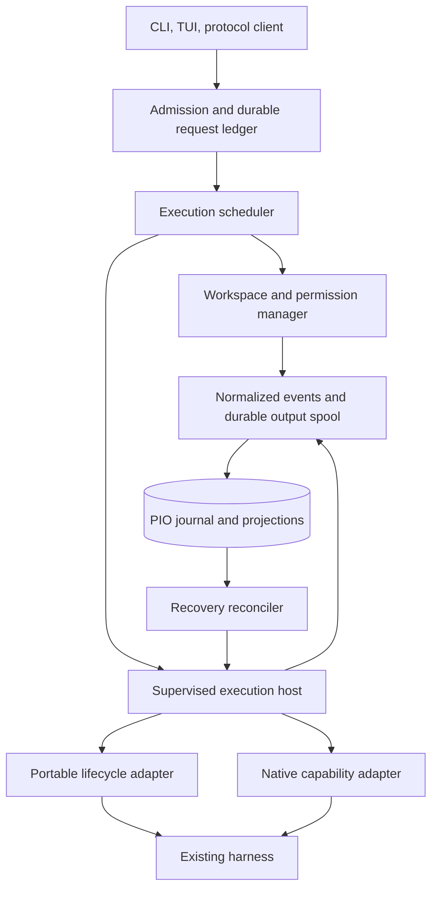
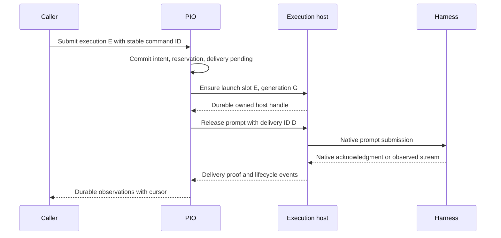

> Public edition `public-development-v1-20260913`. Adapted from the reviewed architecture baseline; names in the source may still say Comreton. See [publication and authority](https://github.com/Combraton/combraton/blob/main/docs/architecture/PUBLICATION.md). Development sequencing is governed by [DEVELOPMENT](https://github.com/Combraton/combraton/blob/main/docs/DEVELOPMENT.md); self-development is deferred until all four usable v0.1 releases.

# PIO: independent harness execution

> Accepted independent execution architecture in [BASELINE](https://github.com/Combraton/combraton/blob/main/docs/architecture/BASELINE.md). Wire schemas and actual adapter capabilities are established through conformance and real-provider tests.

The [internal design](INTERNALS.md) refines fenced claims, invocation accounting, budget liability, completion receipts and recovery. It preserves these public operation meanings and Comreton's control authority.

## 1. Promise and boundary

PIO runs the harness a developer already uses, preserving its native agent loop while exposing reliable execution identity, delivery, permissions, workspaces, output, usage, and recovery. A standalone user can submit a bounded brief, inspect/steer it, and recover after a disconnect without installing CBR or Comreton.

PIO owns execution truth. It reports what the process, adapter, and workspace actually did. It does not decide whether an architecture is right or a product requirement has been satisfied. A caller may review outcomes through PIO's interface, but that review is an attributed caller decision rather than a process exit state.

CBR can be a standalone PIO caller for an authorized existing-harness investigation. Such a request binds a memory job, scope and budget; it need not create a Comreton project workflow. CBR's own direct model/tool loop can also operate without PIO. PIO does not become the scheduler of CBR memory artifacts or the owner of their acceptance.

## 2. Internal boundaries

Admission, supervision, and adapter normalization are separate. A transport supporting structured prompts does not necessarily support process reattachment, output replay, or enforcing file permissions.

## 3. Adapter contract

The portable lifecycle contains inspect capabilities, prepare execution, submit prompt, observe progress/result, request cancellation, and reconcile known execution. Optional capabilities include native resume/fork, active-turn steering, manual compaction, approval delegation, cost/quota reporting, output replay, and detached operation.

A capability is an evidenced predicate with adapter version, harness version, protocol version, host/auth context, last probe, limits, and enforcement level. Example: `resume=after_turn` does not imply `resume=at_arbitrary_message`; `cancel=request_supported` does not imply `external_effects_stopped`.

| Integration | Recommended role | What must be tested |
|---|---|---|
| Codex app-server | Native structured adapter for rich Codex interaction | Pinned schema, start/turn/interrupt/resume/fork behavior, subscriptions, approvals, transport lifetime |
| Claude Code structured mode and hooks | Native adapter preserving its session and permission behavior | Actual installed flags/events, boundary capture, replay, cancellation, compaction and auth |
| ACP | Portable structured adapter for implementations advertising compatible capabilities | Negotiated version and actual lifecycle; v1 and draft-v2 mappings differ |
| Another documented API | Native adapter under the same PIO execution model | Identity, delivery proof, cancellation, durable observation coverage |
| PTY-only harness | Explicitly limited interactive compatibility | Bytes written and observed output; no fabricated prompt acknowledgment or reliable completion |

The current [Codex documentation](https://learn.chatgpt.com/docs/app-server) exposes threads, turns, resume/fork, steering, and streamed events, with version-specific generated schemas and experimental surfaces. The [ACP v1 prompt lifecycle](https://agentclientprotocol.com/protocol/v1/prompt-turn) completes through its prompt response; the [v2 SDK session](https://docs.rs/agent-client-protocol/latest/agent_client_protocol/struct.V2Session.html) is marked draft/unstable and separates prompt acceptance from completion. These are distinct adapter mappings, not interchangeable assumptions.

## 4. Launch without an invisible duplicate

1. Validate the bounded brief, target adapter, permissions, budget, and workspace policy.
2. Commit the execution ID, launch intent, brief digest, and reservation before launch.
3. A supervised host acquires a uniquely owned launch slot keyed by execution ID and generation.
4. Start the harness behind a launch barrier where the host supports it. Persist the host/process/native-session handles before releasing the actual prompt.
5. Record prompt submission intent before external I/O. Preserve the native acknowledgment or explicitly limited delivery proof.
6. Stream durable semantic observations and separately spooled output.
7. Persist and publish observed result receipts under their original identity, even while reconciliation is pending. Reconcile actual process/workspace state before releasing conflicting write leases or claiming the relevant execution/effect obligations are resolved. Publication never implies project acceptance.

The launch barrier narrows the spawn-before-record crash window; it does not make an operating-system spawn atomic with SQLite. Recovery must enumerate unbound launch slots and owned children. A host/adapter that cannot reconcile ambiguous launches cannot advertise unattended safe retry for them.

## 5. Honest states

| Axis | Example values | What it establishes |
|---|---|---|
| Admission | queued, admitted, refused | PIO capacity and policy decision |
| Delivery | pending, acknowledged, failed_before_delivery, ambiguous | Whether the brief is known to have reached its destination |
| Runtime | preparing, active, requires_action, quiescent, exited, unknown | Current observed execution state |
| Result | absent, partial, returned | Output availability |
| Exit | code, signal, forced termination, unavailable | Process outcome, where meaningful |
| Evaluation | external reference or not_requested | Caller/verifier assessment, never inferred from exit |

An ambiguous delivery is an immutable observation about a particular submission episode. A later reconciliation can establish delivered or not delivered; preserve both events. Calling ambiguity a terminal observation must not prevent learning its eventual outcome.

`provider_ack_id`, `echo`, and `transport_only` are different proof classes. Only an adapter contract can say what an echo proves. A successful PTY write remains `bytes_written`; do not label it acknowledged delivery.

A completion receipt records the observed result payload and original execution/claim identity. Matching retransmission returns the receipt; conflicting content under that identity is rejected. Local receipt durability, remote publication, process/effect reconciliation and external verification are separate facts. Replaying a previously committed old-attempt receipt preserves history but cannot finalize its successor. See [completion internals](INTERNALS.md).

## 6. Durable host and session continuity

The desktop closing should not terminate work. PIO's daemon supervises execution hosts; hosts may outlive daemon reconnects under policy and retain bounded output, active approval requests, and native identity. The operating system or a service supervisor manages their lifetime independently of a UI client.

One controller lease owns mutable commands for a host at a time. Reconnection increments a controller epoch and resumes from a durable cursor. A stale controller cannot send new prompts through the host. Read-only observation clients may coexist. Opening the native interface is allowed through an advertised attach mode or an explicit controller handoff, not uncontrolled dual input writers.

Native resume/fork is optional. If it is unavailable, start a new conversation from the checkpoint and packet. Label it a fresh continuation, not a resumed session. Harness-internal hidden state cannot be reconstructed by PIO unless the harness exposes it.

## 7. Workspaces and actual enforcement

Read-only research may use a shared source snapshot. Concurrent writes require distinct workspaces or a deliberately serialized shared-workspace mode. A worktree isolates code changes but is not a security sandbox: shell commands can still reach other directories or external services unless enforced restrictions prevent them.

Each workspace lease names repository, base/snapshot, writer identity, lease epoch, permitted paths/effects, and cleanup policy. PIO probes before/after state itself and records dirty/untracked coverage. Agent-reported Git SHAs are annotations, not authoritative workspace receipts.

Permissions distinguish OS-enforced restrictions, mediated tool restrictions, and cooperative instructions. A contract requiring hard network denial cannot run merely because its prompt says “do not access the network.” If the adapter cannot enforce a required restriction, admission fails with an actionable alternative.

Arbitrary harness tools do not all pass through Comreton. Therefore the controller cannot guarantee interception of every external effect. Either the sandbox/tool boundary enforces the scope, or the user authorizes a clearly disclosed broader capability. This limitation is part of the execution contract.

### Preserve native iteration within the grant

PIO does not put a controller approval between each native search, edit and test. Routine investigation/repair continues within the caller's grant, enforced effect boundaries and resource limits. Failed test evidence can be published while the same harness continues repair. A controller gate on outcome adoption or production application is not an instruction to terminate local development.

An isolated development workspace and separately authorized production provider action can support broad iteration with narrower consequential effects; actual backend support must be tested. Required restrictions remain enforceable even if CBR has not yet detected a semantic problem. PIO cannot silently broaden the grant to avoid a native permission wait.

For steering, distinguish request recorded, native delivery acknowledged and subsequent observed behavior. Delivery never proves comprehension. If live steering is unavailable, report it and use an explicitly supported continuation or interrupt/restart policy. Revocation governs future mediated effects; already-sent actions require reconciliation. These meanings also apply to standalone callers without importing Comreton's UI or template model. See [STEERING](https://github.com/Combraton/combraton/blob/main/docs/architecture/STEERING.md).

## 8. Cancellation, fencing, and recovery

Cancel commits the request, forwards it through the native supported mechanism, and observes the outcome. Escalation to process-group termination requires verified ownership and applicable policy. A PID number without host identity and start-generation proof is insufficient.

| Failure | Recovery |
|---|---|
| Request acknowledgment lost | Query by stable command/delivery ID before any new submission |
| PIO restarts after writing to harness | Mark submission ambiguous; reconcile host/native execution |
| Controller disconnects | Reattach to known host and replay cursor; do not respawn by default |
| Reattach fails | Inspect ownership, process state, and external obligations; do not blindly kill |
| Process exits but workspace persists | Capture resulting state and pending descendants before lease release |
| Old attempt returns after replacement | Preserve under old attempt; reject successor completion |
| Stream spool exhausted | Apply backpressure; persist explicit dropped-range coverage for telemetry |
| Semantic event storage unavailable | Stop admitting effects; preserve uncertainty for in-flight work |

Fences prevent stale commands/results from being accepted by cooperating hosts and services. They cannot retract an API call already sent by an unrestricted process. Outstanding external effects survive timeout, abandonment, and workflow cancellation as reconciliation obligations.

Temporal's [completion token check](https://github.com/temporalio/temporal/blob/2220587dea828d938fc99253e178a13d1cb658c5/service/history/api/activity_util.go#L58) is a concrete precedent for attempt/version fencing. It does not establish exactly-once external effects.

## 9. Scheduling and budgets

Begin with bounded priority classes and fair queues, not a port of a CPU scheduler. Separate queue timeout, delivery timeout, execution deadline, inactivity timeout, and reconciliation deadline. A long non-preemptible model call consumes its slot until observed completion or safe detachment.

PIO owns host/provider admission and reports queue reason. Comreton owns project-level willingness to spend. PIO alone accepts a standalone budget from its caller. Usage records distinguish observed tokens/cost, estimates, and unavailable data; subscription credits are not invented dollar prices.

The [invocation and budget ledger](INTERNALS.md) is mandatory for PIO-visible dispatch history even when no spending cap is configured. Separate execution IDs, observable invocation IDs, dispatch rights and completion IDs. Claim mutations require their current ownership token; expiry alone does not establish that the prior writer stopped. Timeout or lost acknowledgment preserves unresolved liability rather than refunding it. Opaque harness-internal calls have declared coverage limits; an estimate cannot establish a hard billed-dollar ceiling.

## 10. Standalone contracts and conformance

The standalone API supports submit, inspect, watch, steer when supported, cancel, reconcile, workspace checkpoint, and artifact export. TUI and CLI render the same execution facts. An external caller can attach arbitrary correlation metadata without importing Comreton's template model.

Release fixtures must cover duplicate submission, lost acknowledgment, spawn crash window, PID reuse, stale controller, approval wait through restart, partial stream replay, dirty worktree, fork capability absence, cancellation refusal, daemon restart, budget exhaustion, and late result fencing. Run adapter fixtures against pinned real harness versions separately from deterministic fake-host tests. Passing one does not prove the other.

## Context preparation and execution admission

Comreton or a standalone caller selects context obligations; PIO does not decide which project knowledge is mandatory. A request requiring context before start is admitted as ready only with the corresponding authorized binding. Advisory enrichment does not add an implicit startup barrier. A condition required before a later transition governs that transition, while authorized investigation can continue.

Do not reserve a scarce harness slot or exclusive workspace writer solely while waiting for preparation that needs that resource. CBR may submit a separately granted investigation to PIO; retain its own execution identity without inventing a Comreton workflow node. Direct-model CBR jobs need no PIO process.

Delivery records identify exact packet/update digests, target execution/native session, supported boundary and actual outcome. Unsupported steering, late arrival and unknown delivery remain visible; a receipt proves neither comprehension nor compliance. Relevant authority changes follow existing epoch, revocation, interruption and reconciliation contracts. The caller's readiness check is not an atomic transaction with an opaque harness action. See [CBR delivery](https://github.com/Combraton/cbr/blob/main/docs/spec/PREPARATION-AND-DELIVERY.md).

## Standalone discovery, terminal management and CBR client

The [standalone client contract](STANDALONE-CLIENT.md) defines supported-harness discovery, truthful capability states, multiple native sessions, explicit user/caller authority and optional CBR enrichment. The CLI/TUI application carries caller scope and context policy; the execution core does not invent knowledge requirements. Combraton later uses the same public service contracts directly, without embedding the TUI.
