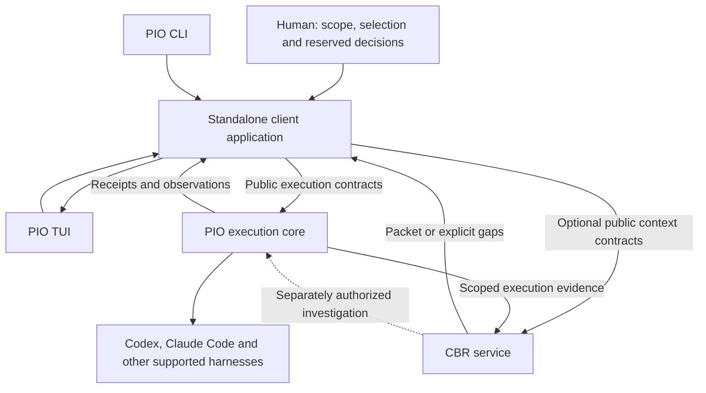

# Standalone PIO client and optional CBR integration

Accepted direction, 13 September 2026. This specifies the standalone CLI/TUI application over the [PIO execution API](SPEC.md), with optional public CBR integration. It introduces no dependency on Combraton. See the [cross-system decision](https://github.com/Combraton/combraton/blob/main/docs/decisions/001-standalone-first-and-evaluation.md).

## 1. What the user gets

A user opens PIO, sees supported harness installations and configured endpoints, chooses workspaces and harnesses, starts scoped work, watches several executions, responds to native permission requests, steers where supported, and recovers after disconnect or restart. The TUI is a first-class standalone interface. CLI operations support automation and evaluation without driving terminal pixels.

CBR is an optional context provider. The user can request useful project context and preserve eligible observations across sessions. PIO remains useful with CBR disabled or absent; CBR remains independently usable with direct callers and model providers.

The arrows denote authenticated public operations under explicit grants. Event-to-evidence publication is an optional configured producer integration, not unrestricted access to PIO's journal. The standalone client and execution core can ship in the same package; logical responsibility and public contract boundaries still apply.

## 2. Three responsibilities inside the standalone experience

| Part | Responsibility | Boundary |
|---|---|---|
| Terminal presentation | Render status, panes, commands and user choices | Does not own durable execution or memory state |
| Standalone client application | Carry the user's selected task, grant, context requirements and operation correlations into public service calls | Does not invent project authority, a template engine or Combraton's project model |
| PIO execution core | Admission, scheduling, workspace/process/session lifecycle, observations, delivery and reconciliation | Does not choose what knowledge a project must accept or infer success from memory confidence |

The client is an attributed caller. It may apply an explicitly chosen local policy, such as “require the current migration constraint before starting this task.” That policy is not an intrinsic PIO execution rule. CBR reports applicability and missing material; it does not grant permission. A later Combraton caller supplies its own authority and readiness through the same service boundaries.

Persist the minimum caller state needed to recover outstanding operations: request/correlation identities, selected scope/policy basis, service operation references and exact packet binding references. Keep it distinct from PIO execution facts and CBR canonical records; do not copy their mutable stores. Write the request identity before external submission and reconcile pending operations on client restart. This is a bounded client record, not a new general workflow scheduler. Physical storage/package details remain implementation selections.

The TUI process exiting does not by itself cancel detached work. Closing, detaching and canceling are distinct explicit operations. A reopened client queries actual service state and delivery observations; it must not replay a remembered “start” action as a new execution.

## 3. Discovery is not proof of capability

Use registered adapters, known executable locations/PATH and explicitly configured endpoints. Probe documented non-destructive version/capability surfaces with time limits. Show the discovered path/endpoint and version so duplicate installations are distinguishable; allow explicit selection and refresh.

Track separate facts: detected, adapter recognized, version supported, authentication known/unknown, endpoint reachable, and capabilities last verified. A detected binary is not necessarily authenticated, usable, resumable or able to enforce a grant. Authentication status can remain unknown until an authorized operation establishes it. Do not silently log in, install software, scan arbitrary credential stores or start paid work as a discovery probe.

Record harness version, adapter version, environment, probe time, supported operations and enforcement/observation limits. Recheck relevant capabilities after a version or endpoint change. PIO can enumerate supported installations; it cannot promise to discover every possible agent application automatically.

## 4. Managing multiple harnesses

Each execution has its own durable PIO identity, native session reference when available, workspace, grant, usage coverage and state. Display running, waiting, stopped and unknown states according to observed facts. Native approval requests belong to their originating execution; answering one must not authorize another.

Users can inspect output, attach/detach, send supported steering, request cancellation and resume/reconcile according to each adapter's capabilities. Preserve native investigation/edit/test loops rather than asking for approval between routine operations. Do not infer task acceptance from a terminal tab becoming idle or a process exiting zero.

Parallel writers require appropriate workspace isolation or explicit serialized ownership. Two harnesses in two panes do not establish independent filesystem or external-resource access. Show queue reasons and unresolved usage honestly; subscription usage cannot be converted into a fictional exact dollar amount.

## 5. A concrete context-to-execution flow

1. The human chooses a harness, workspace, task and grant. In memory-assisted mode, the user or explicitly selected policy declares context scope, requirements, packet budget and timing. Core execution works without this mode.
2. The client records a stable operation identity and asks CBR through the Context profile, with the applicable code/environment basis. No Combraton project or template identifier is required.
3. CBR supplies a packet/reference with exact bytes/digest, provenance, applicability and explicit gaps. It can run bounded model-assisted preparation under the separate allowed budget.
4. For required-before-start material, the client submits ready execution only after that obligation is satisfied against the selected basis. Advisory context is non-blocking; missing or late context remains visible. A required item at deadline remains unmet.
5. PIO validates and journals the authorized execution and packet binding, then dispatches through the selected adapter. A changed authority/basis must invalidate stale readiness as defined by the public contracts; no distributed transaction is implied.
6. PIO reports the actual observation level: submission, acknowledged delivery where supported, execution events and completion receipt. The TUI can show the exact packet. None of these facts proves model comprehension.
7. Authorized producers publish eligible output, tool/test evidence and provenance to CBR. Ingestion coverage is declared; terminal text is not automatically a complete tool trace or a verified fact. CBR updates memory through its own validated revision path.
8. After a context reset or a new task, the client requests a new packet using current evidence and scope. Earlier packets and observations remain inspectable; old bytes are not silently relabeled current.

A “remember this” action records the user's statement and its explicit scope/authority. It must preserve the distinction between user intent and observed behavior. Background summaries cannot turn it into a broader universal rule.

## 6. Failure and reciprocal-call rules

**CBR unavailable:** memory-disabled use continues normally. Advisory use can proceed with a visible gap. Required-context work waits at its named boundary until satisfied or the authorized caller explicitly changes the requirement. There is no silent fail-open downgrade.

**Preparation requires a harness:** CBR may request a separately granted PIO investigation with its own memory-job and execution identities. The waiting consumer must not hold the only execution slot or exclusive workspace lease that preparation needs.

**Avoid recursion:** an execution requested by CBR is not automatically enriched through the standalone client's CBR path again. That path is initiated by a declared caller request, not attached indiscriminately to every PIO dispatch. Any further investigation must be explicitly bounded by the memory job's depth/call/resource budget.

**Cancellation:** canceling one packet subscriber does not automatically cancel a shared preparation job or other executions. Apply the existing ownership and subscriber semantics. Cancellation requests, stopped processes and reconciled external effects remain separate observations.

**Correction races:** retain the request basis and exact packet binding. A correction during preparation or before dispatch requires the contracted applicability/readiness handling; it cannot be hidden by a successful packet fetch. Later corrections become visible updates with truthful delivery timing.

**Client restart/lost acknowledgment:** recover operation identities and query/reconcile the owning services before retrying. Do not blindly repeat CBR derivations or PIO starts because the terminal lost its response.

## 7. What changes when Combraton arrives

Combraton calls PIO and CBR directly through their public profiles. It does not embed, drive or depend on the TUI. Its desktop presents richer project/workflow/history/steering concepts and owns the associated control-plane decisions. The PIO TUI continues as an independent product interface.

Both clients should be able to observe the same authorized PIO execution. Concurrent control must respect scoped authority/epochs and ownership; opening the TUI does not grant it permission to override a Combraton-controlled execution. Useful terminal renderers or client utilities may be reused only without importing TUI state as service truth.

Combraton is more than a graphical skin on PIO. It adds project-level intent, executable graph coordination, acceptance and history adoption while retaining the same independent execution and memory services.

## 8. Standalone acceptance

Prove discovery with absent, unsupported, duplicate and unreachable installations/endpoints. Test no-CBR operation, CBR-only direct operation, optional memory enrichment, multi-harness execution, missing required context, daemon/client restart, delivery limitations, source correction, shared-subscriber cancellation and the preparation-resource cycle.

Use real supported harness versions for adapter claims and deterministic fake endpoints for fault injection. Protocol conformance fixtures remain owned by Protocol. The [benchmark repository](https://github.com/Combraton/benchmarks) composes and compares public behavior; it cannot redefine service contracts to make a scenario pass.

This file specifies target behavior. It introduces no implemented CLI flags, API fields, TUI code, automatic discovery runtime or benchmark results.
